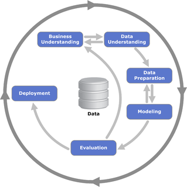

# Introduction

```{r setup, echo=FALSE, 	message = FALSE,warning = FALSE}
knitr::opts_chunk$set(center = TRUE)
```

This article aims to analyse and provide insights from the monthly transaction data set in order to better understand the customer transaction patterns. The article also offers a study on linear regression model, an important concept in the field of machine learning, and discusses how this model can assist in the decision-making process of identifying trends in bank transactions within the years of 2013 - 2016.

To well capture this information, the CRISP-DM management model is adopted to provide a structured planning approach to a data mining project with 6 high-level phases. In particular, these phases assist companies in comprehending the data mining process and serve as a road map for planning and executing a data mining project (Medeiros, 2021). This study explores each of the six phases, and the tasks associated with each in the following orders:

* [Business understanding](#bu)\
* [Data understanding](#du)\
* [Data preparation](#dp)\
* [Modeling](#m)\
* [Evaluation](#e)\
* [Deployment](#d)

```{r residuals, echo=FALSE, out.width="40%",fig.cap="Cross-Industry Standard Process for Data Mining (CRISP-DM project, 2000)",fig.align="center"}

```

# Business Understanding {#bu}

**Business Understanding** is the first taken step in the CRISP-DM methodology. In this stage, the main task is to understand the purpose of the analysis and to provide a clear and crisp definition of the problem in respect of understanding the *Business objectives* and *Data mining objectives*.


In our case study, the posed question related Business object paraphrased from the sale manager's request is: “what is driving the trends and increase total monthly revenue?”. On the other hand, we wish to achieve the data mining object by applying data visualization tools to identify any underlying patterns from the dataset.

# Data Understanding {#du}

Following that, the **Data Understanding** phase is where we focus on understanding the data collected to support the Business Understanding and resolve the business challenge (Wijaya, 2021). Data preprocessing and data visualization techniques play an essential role in this. Thus, I'm going to divide the section into 2 main components:

* [**Exploratory Data Analysis (Part 1) - The Dataset**](#eda1)\
  * [**Stage 1:** Basic Exploration](#be)\
  * [**Stage 2:** Univariate, Bivariate & Multivariate Analysis](#ubma)\
* [**Exploratory Data Analysis (Part 2) - The Business Insights**](#eda2)\

The data was imported into the software package R to construct visualizations represented the findings found during the analysis.

## Exploratory Data Analysis (Part 1) - The Dataset {#eda1}

### Stage 1: Basic Exploration {#be}

First, I will run the libraries which will be necessary for reading & manipulating our data and then conducting the graphs.

```{r, message = FALSE, warning = FALSE}
library(here)         # assess the file path
library(DataExplorer) # EDA visualizations
library(tidyverse)    # data wrangling
library(kableExtra)   # write table
library(ggplot2)      # data visualization
library(ggradar)      # plot seasonal trend
library(sqldf)        # using SQL
library(car)          # calculate the VIF 
library(dplyr)        # data processing
library(gganimate)    # create animated plots
library(ggpubr)       # comebine plots into single page
theme_set(theme_pubr())
library(reshape2)     # transpose table
library(fmsb)         # create radar chart
library(modelr)       # computing regression model performance metrics
library(caret)        # streamline the model training process
library(forecast)     # times-series forecasting
library(xts)          # convert df to ts object
```

Once libraries are loaded, we explore the data with the goal of understanding its dimensions, data types, and distribution of values. In this assignment, a time series data set of financial transactions was used as the major source of data. The attributes information is specifically presented in Appendix []. 

```{r message=FALSE, center=TRUE}
# read the dataset and covert it into a df object
df <- read_csv(here("dataset/transactions.csv"))
df_overview <- introduce(df) %>%                  # Quick summary: index and column data types, non-null values and memory usage
  t()                                             # transpose the info for better display

df_overview %>%                                   
  kbl() %>%                                       # turn output into a table format
  kable_styling(bootstrap_options = "striped",    # apply bootstrap theme to the table
                full_width = F) 
```

As apparent from the table, the data records 470,000+ observations across 5 columns, which are equivalent to 94,000+ bank transactions. The 5 features contained in this data set including `date`,	`customer_id`, `industry`,	`location`,	`monthly_amount`, clearly indicates the total transactions amounts for customers each month spanning a 3-year period over a range of industries and locations. Therefore, no further justification needs to be made on column names. 

```{r}
sapply(df, class) # inspect columns data type
```

It is also worthwhile to note that features are made up in multiple formats that include both numerical and time-series data. However, the output shows that the `date` column has the wrong data type which will need to be converted to date format later. 

Additionally, I investigate further by looking at the response field. Recall from the business question, we would expect to use the `monthly_amount` column as the target field since our goal is to get the predicted value of the monthly transaction value next month. Since the observation in this column are continuous, thus, I can conclude that our problem is defined as the supervised regression problem. Having known this information is extremely essential to select the right Machine Learning model in the later stage of this report. 

```{r fig.align="center", fig.cap="Missing values plot"}
# Plot the Quick summary information
plot_missing(df)
```
From the plot, it shows that there are no missing values on any fields of data. Nevertheless, some data sets define missing observations in categorical/character columns as a new category such as `"NA"`, `"NULL"`, etc. Thus, there are chances that we possibly miss these observations, which can lay a tremendous negative impact on the real data distribution. Consequently, a further address on the missing values of our categorical columns need to be made in order to confirm this observation.

```{r}
# convert character values of character columns to upper case for better checking
missing_df <- data.frame(lapply(df, function(v) {
  if (is.character(v)) return(toupper(v))
  else return(v)
}))

# check if there is there is missing values assigned under new category
## date column
sprintf(paste0("Is there any missing value observation categories in date column (T/F)?: ", 
               missing_df[1] %in% c("NA","N/A","NULL","")))
## customer_id column
sprintf(paste0("Is there any missing value observation categories in customer_id column (T/F)?: ", 
               missing_df[1] %in% c("NA","N/A","NULL","")))

# Check for any transaction with zero values
sprintf(paste0("How many rows contained 0 value in monthly transaction amount?: ", 
               sum(df$monthly_amount==0)))
```
The code output below interprets that there is no new missing value category exists in categorical columns. Thus, we can confirm our hypothesis that there is no missing values from both numerical and categorical columns in this data set.Furthermore, it also indicate that there are 1 row that contain odd value in `monthly_amount` column that will need to be resolved.

### Stage 2: Univariate, Bivariate & Multivariate Analysis {#ubma}

To evaluate the impact of each feature in the phenomenon, a univariate, bivariate, and multivariate analysis is performed with all features.

#### Univariate: Check the distribution of each field

The univariate analysis is the study of the data distribution. In research from Sharma (2020), the distributions of the independent variable and the target variable are assumed to be a crucial component in building linear models. Therefore, understanding the skewness of data helps us in creating better models. 

Firstly, I will plot a histogram to check which group of industry and location statistically contribute the most to the significant difference.

```{r fig.align="center", fig.cap="Data distribution", message=FALSE, warning=FALSE}
# combine 2 plots into 1 plot
par(mfrow=c(1,2))

# plot data distribution of MONTHLY_AMOUNT group by INDUSTRY
hist(df$industry, # create historgram
     main = "Trans by Industry", 
     xlab="Industry", 
     xlim = c(0,10), 
     ylim=c(0,50000), 
     las=0)

## plot data distribution of MONTHLY_AMOUNT group by LOCATION
hist(df$location, # create histogram
     main = "Trans by Location", 
     xlab="Location", 
     xlim = c(0,10), 
     ylim=c(0,50000), 
     las=0)
```
As can be seen from the plot, the location 1 and 2 made the top contributions for the `industry` column while the industry 2 and industry 1 occupied for the highest frequency distribution for the `location`. These results imply that the model can perform better at predicting the total transaction amount for next month with location 1, 2 and/or industry 1, 2.

```{r fig.align="center", fig.cap="Boxplot to check for outliers when plotting Monthly Amount against Location & Industry", message=FALSE, warning=FALSE}
# combine 2 plots into 1 plot
par(mfrow=c(1,2)) 
# plot boxplot to check for outliers
boxplot(monthly_amount~industry, 
        data=df, 
        main='Transaction vs. Industry',
        xlab='Industry', 
        ylab='Transaction Amount', 
        horizontal=TRUE) + 
  scale_fill_grey() + 
  theme_classic()

boxplot(monthly_amount~location, 
        data=df, 
        main='Transaction vs. Location',
        xlab='Location', 
        ylab='Transaction Amount', 
        horizontal=TRUE) + 
  scale_fill_grey() + 
  theme_classic()
```

Next, boxplot of sale transactions by the industry and location present their high variance with considerable amount of outliers. The median amount of spending per customer for industry 6 and 9 are highest, over 500,000 while the lowest ones belong to industry 1 and 10, less than 200,000. In terms of locations, most of locations had its median amount of spending less than 500,000.

#### Bivariate Analysis: Relationship between each column and target field & Collinearity

After having known the distribution of our `transaction` dataset, it is essential to also check for correlation and collinearity assumptions between fields in the Bivariate Analysis. Some basic transformations regarding data types are performed beforehand for the sake of plotting visualizations.

```{r fig.align="center", fig.cap="Correlation Plot", message=FALSE, warning=FALSE}
########################################################
# DATA TRANSFORMATION
########################################################
# convert date column into the date format
df$date <- as.Date(df$date,"%d/%m/%Y")

# convert customer_id column into character format
df$customer_id = as.character(df$customer_id, format = "")

# convert location column into character format
df$location <- as.character(df$location)

# convert industry column into character format
df$industry <- as.character(df$industry)

# filter out value with 0 transaction amount
df<-filter(df, monthly_amount!=0)

########################################################
# DATA VISUAIZATION: CORRELATION PLOT
########################################################
plot_correlation(df)
```

Having known this information is essentially important to gain better understandings about the transaction data set and provide great insights for transforming data in the later stage.


## Exploratory Data Analysis (Part 2) - The Business Insights {#eda2}

```{r message=FALSE, warning=FALSE}
############################
# DATA TABLE TRANSFORMATION
############################
# create new df contain total transaction amount
transaction_amount <- sqldf(
"SELECT
  date,
  'Transaction Amount' as type,             -- specify value type
  SUM(monthly_amount) AS value              -- sum total transaction amount
FROM df
GROUP BY date                                -- filter by date
ORDER BY date
"
)

# create new df contain number of transaction
transaction_count <- sqldf(
"SELECT
  date,
    'Transaction Count' as type,             -- specify value type
  COUNT(*) as value                         -- count total number of transactions
FROM df
GROUP BY date                                -- filter by date
ORDER BY date
"
)

# merge 2 df into 1 new TRANSACTION df vertically 
transaction_df <- rbind(transaction_amount, 
                        transaction_count)

# create new INDUSTRY df contain total transaction by industry over time
industry <- sqldf(
"SELECT
  date,
  industry,
  SUM(monthly_amount) AS transaction_amount, -- sum total transaction amount
  COUNT(*) as transaction_count              -- count total number of transactions
FROM df
GROUP BY 
  date,                                      -- filter by date
  industry                                   -- filter by industry
ORDER BY date
"
)

# create new LOCATION df contain total transaction by location over time
location <- sqldf(
"SELECT
  date,
  location,
  SUM(monthly_amount) AS transaction_amount, -- sum total transaction amount
  COUNT(*) as transaction_count              -- count total number of transactions
FROM df
GROUP BY 
  date,                                      -- filter by date
  location                                   -- filter by location
ORDER BY date
"
)
```


```{r fig.align="center", fig.cap="Transaction amount vs. transaction number trend over time", message=FALSE, warning=FALSE}
#################################################################
# # Data Visualization: Transaction amount vs. transaction number
#################################################################
# plot transaction amount over time
monthly_amount_plot <- transaction_df %>% 
  filter(type=="Transaction Amount") %>%        # filter by transaction amount only
  ggplot(aes(x = date, y = value/1e6)) +        # assign x and y-axis from the dataset
  geom_line(color = "indianred", size=1.6) +    # add the line graph, color, and the size
  geom_smooth(formula = y~x,                    # the relationship graph between x and y
              method = 'loess') +
  labs(x = "Year", 
       y = "Total transaction amount (in millions)",
       title = "Monthly Transaction Amount",
       subtitle = "2013 to 2016") +
  theme_minimal()

# plot total transaction number over time
monthly_count_plot <- transaction_df %>% 
  filter(type=="Transaction Count") %>%         # filter by total transaction number count only
  ggplot(aes(x = date, y = value)) +            # assign x and y-axis from the dataset
  geom_line(color = "indianred", size=1.6) +    # add the line graph, color, and the size
  geom_smooth(formula = y~x,                    # the relationship graph between x and y
              method = 'loess') +
  labs(x = "Year", 
       y = "Total transaction number",
       title = "Total Transaction Number",
       subtitle = "2013 to 2016") +
  theme_minimal()

## combine individual plots into a single page  
ggarrange(monthly_amount_plot,
          monthly_count_plot,
          ncol = 2, nrow = 1)
```

Number of transactions and total amount of sales rose sharply throughout the years, from 2013 to 2017. The seasonal trend can be found on total amount of sales while the up trend for number of transactions is quite smooth. 

I would like to decompose the data to check the seasonal, trend and error from the data from ts object with daily and weekly seasonality

```{r}
# convert df to ts object

ts_df <- ts(transaction_df[-2], frequency=12, start = c(2013, 1), end=c(2016,11))
decompose_ts_df <- decompose(ts_df)
autoplot(decompose_ts_df)
```

We could see that there are seasonal pattern, although the trend is not clear yet. To investigate more, we would make yearly polar plot:

```{r fig.align="center", fig.cap="Seasonal Trend Over the Years", message=FALSE, warning=FALSE}
############################################################
# Data Visualization: Seasonal Trend Over the Years
############################################################
# Create new MONTHLY_TREND df to plot seasonal transaction trend
new_ts_df <- sqldf(
"SELECT
   strftime('%m', date) as month,   --extract month from date column                   
   strftime('%Y',                   --extract year from date column
   date * 3600 * 24,
   'unixepoch') as year,
  SUM(monthly_amount) AS transaction_amount
FROM df
GROUP BY
  month,
  year
ORDER BY
  month,
  year
"
)

# transpose the dataset to prepare for the data visulization
monthly_trend <- recast(new_ts_df, 
                        year + variable ~ month, 
                        id.var = c("month", "year"))
monthly_trend <- data.frame(monthly_trend[,-1],            # use the first column as the data index
                            row.names = monthly_trend[,1]) # use the first row as the header
monthly_trend <- subset(monthly_trend, select = -variable) # remove the unecessary column

# create new vector specify month column names
colnames(monthly_trend) <- c('January', 'February', 'March', 'April', 
                             'May', 'June', 'July', 'August', 'September', 
                             'October', 'November', 'December')

##################################
## RADAR CHART FOR ALL YEARS
################################## 

# To use the fmsb package, I have to add 2 lines to the dataframe: the max and min of each variable to show on the plot!
data <- rbind(rep(1400e6,12) , rep(0,12) , monthly_trend)
 
# Color vector
colr_1 <- rgb(0.2,0.5,0.5,0.9)
colr_2 <- rgb(0.8,0.2,0.5,0.9)
colr_3 <- rgb(0.7,0.5,0.1,0.9)
colr_4 <- "#FC4E07"

# set color theme for radar border
colors_border=c(colr_1, 
                colr_2, 
                colr_3, 
                colr_4)

# plot with default options:
seasonal_mul_plot <- 
  radarchart(data, axistype=0,
    #custom polygon
    pcol=colors_border, plwd=2 , plty=1,
    #custom the grid
    cglcol="grey", cglty=1, axislabcol="grey", cglwd=0.8,
    #custom labels
    vlcex=0.8, title=paste("Transaction Seasonal Trend"), cex.main = 1
    )
# Add a legend
legend(seasonal_mul_plot, x=1.5, y=0.5, legend = rownames(data[-c(1,2),]), 
       bty = "n", pch=15 , col=colors_border, text.col = "black", cex=1.2, pt.cex=1, title = "Year")

##################################
## BAR CHART FOR INDIVIDUAL YEARS
################################## 

ggplot(new_ts_df) +
 aes(x = month, fill = year, weight = transaction_amount/1e6) +
 geom_bar() +
 scale_fill_brewer(palette = "Dark2", 
 direction = -1) +
 labs(y = "Total transaction amount (in millions)", title = "Monthly Seasonal Trend", 
 subtitle = "Individual Year (from 2013 to 2016)") +
 coord_flip() +
 theme_minimal() +
 theme(legend.position = "none", 
 plot.title = element_text(size = 15L)) +
 facet_wrap(vars(year), scales = "free", nrow = 1L)
```

A closer examination reveals that the total volume of transaction amount increases significantly from January to October and subsequently decreases from November towards the end of the year. This pattern can be ascribed to the fact that people trade less during the holidays, particularly during the month surrounding big holidays like Christmas and New Year. 

This, however, might be based on a variety of different factors rather than on individual conclusions about each region or industry. As a result, additional information is required to substantiate these hypotheses.

```{r fig.align="center", fig.cap="Transaction amount by Location vs. Industry", message=FALSE, warning=FALSE}
#######################################################
# DATA VISUALIZATION: Monthly transaction amount by country and location over time
#######################################################

# plot transaction info by industry
industry_amount_plot <- location_amount_plot <- ggplot(industry) +
  aes(x = date, y = transaction_amount, colour = industry) +
  geom_line(size = 1) +
  scale_color_hue(direction = 1) +
  labs(x = "Year", 
       y = "Total transaction amount (in millions)",
       title = "Transaction Amount",
       subtitle = "By industry (from 2013 to 2016)") +
  theme_minimal()


# plot transaction info by location
location_amount_plot <- ggplot(location) +
  aes(x = date, y = transaction_amount, colour = location) +
  geom_line(size = 1) +
  scale_color_hue(direction = 1) +
  labs(x = "Year", 
       y = "Total transaction amount (in millions)",
       title = "Transaction Amount",
       subtitle = "By location (from 2013 to 2016)") +
  theme_minimal()

# combine plots into a single page  
ggarrange(industry_amount_plot, location_amount_plot,
          ncol = 2, nrow = 1) 

```

When looking at the monthly amount by `location` and `industry`, it is not surprising that total sales of location 1 and 2 increased significantly compared to other locations. Meanwhile, in terms of industry, industry 2, 3 and 1 shows a rapid growing over the years while others’ progress are quite slow.

# Data Preparation {#dp}

## Feature Engineering {#fe}

When the data has been fully understood, data scientists generally need to go back to data collection and data cleaning phases of the data science pipeline so as to transform the data set as per the expected business outcomes.To expand the information that is already at hand and better represent the information we have, the best practice is to perform **Data Preparation** or *Feature Engineering*, meaning the creation of new features from the ones already existing.

In this case study, the data will need to be modified as we will be applying a linear regression model later on.

```{r message=FALSE, warning=FALSE}
# We may want to do this again, so write a function
aggregate_transactions <- function(df) {
    
  # Aggregate the data, grouping by date, industry and location, and calculating the mean monthly_amount
  output = df %>%
    group_by(date, industry, location) %>%
    summarize(monthly_amount = mean(monthly_amount, na.rm = TRUE))
  
  # Let's also create a column for the month number and another one for year number
  output = output %>%
    mutate(month_number = format(as.Date(date), "%m")) %>%
    mutate(year_number = format(as.Date(date), "%Y"))
  
  # Make sure the new columns are of the correct type
  output$month_number = as.character(output$month_number)
  output$year_number = as.character(output$year_number)
  
  transform(output, month_number = as.integer(month_number), year_number = as.integer(year_number))
  
  return(output)

}

aggregated_transactions <- aggregate_transactions(df)

rmarkdown::paged_table(aggregated_transactions)
```

An aggregated data set using the fields `date`, `industry` and `location`, with a mean of monthly amount is created. There are total 3,886 rows with each row presents a mean of monthly amount ranging from 2013 to 2016.

# Train-Test split
Now that we have a new adjusted data set, I'm going to split the data into train and the test set for the aim of building a prediction model. The train set includes three years of data from 2013 to 2016 while test set includes one last year of data, 2016.

```{r}
################################################################################
# TRAIN-TEST SPLIT
################################################################################
# create helper function with the creation of train-test split
create_train_test <- function(df){
  # Test set
  # Use data for the year 2016 to test accuracy
  test_df <- df[df$date >=	"2016-01-01",]   
  
  # Training set
  # Use data for the year 2016 for forecasting
  train_df <- df[(df$date < "2016-01-01"),]
  return (list(train_df, test_df))
}

# Create train and test
# use the adjusted data set with new features
split_list <- create_train_test(aggregated_transactions) 

# train set
train_set <- split_list[[1]] 

# test set
test_set <- split_list[[2]]
```

Additionally, we have 2 requirements in this assignment, which are:

1. **Basic Model Fitting**: Developing a linear regression model with monthly_amount as the target for `industry = 1` and `location = 1`.
2. **Advanced Model Fitting**: Developing a linear regression model with monthly_amount as the target for all industries and locations.

I will generate an additional data set that filtered only Industry 1 and Location 1 records. The train and split test for the Advanced Model Fitting section can be kept the same as there are no further adjustments needed.

```{r}
# create new df filter by only Location 1 & Industry 1
agg_1_1 <- aggregated_transactions %>% 
  filter(industry == 1, location == 1)

# # Create train and test
# use the adjusted data set with new features
split_list_1_1 <- create_train_test(agg_1_1) 

# train set
train_set_1_1 <- split_list_1_1[[1]] 

# test set
test_set_1_1 <- split_list_1_1[[2]]

# create new df to plot our test-train set
# add new column to specify the value type
train_set_1_1$type <- "Train"
test_set_1_1$type <- "Test"

# create data frame to display year range of test and train data
train_test <- sqldf(
  "SELECT * FROM train_set_1_1
  UNION ALL
  SELECT * FROM test_set_1_1
  ORDER BY type;
  "
)

# plot year range of train set & test set (L1 & I1)

ggplot(train_test) +
 aes(x = date, y = monthly_amount, colour = type) +
 geom_line(size = 0.5) +
 scale_color_hue(direction = 1) +
 labs(x = "Year", y = "Total monthly amount", title = "Train-Test Split", subtitle = "Location 1 & Industry 1") +
 theme_classic() +
 theme(legend.position = "bottom", plot.title = element_text(size = 15L))
```

As new dataset is created, I will also use it to create a line plot of the variable `monthly_amount` for `industry = 1` and `location = 1` with the purpose of gaining more insights from targeted areas.

```{r message=FALSE, warning=FALSE}
#######################################################
# DATA VISUALIZATION: Mean Monthly Transaction Amount (Location 1 & Industry 1)
#######################################################
aggregated_transactions %>%
 filter(industry >= 1L & industry <= 1L) %>%
 filter(location >= 1L & location <= 
 1L) %>%
 ggplot() +
  aes(x = date, y = monthly_amount, colour = year_number) +
  geom_line(size = 0.7) +
  geom_point(size=1) +
  scale_color_brewer(palette = "Dark2", direction = 1) +
  labs(
    x = "year",
    y = "Transaction amount",
    title = "Mean Monthly Transaction Amount",
    subtitle = "Industry 1 & Location 1",
    color = "Year"
  ) +
  ggthemes::theme_par() +
  theme(
    plot.title = element_text(size = 12L),
    plot.subtitle = element_text(hjust = 0.5)
  )
```

It is clear from the graph that there is the seasonality trend observed from the mean transaction amount of Industry 1 & Location 1. More specifically, a down trend at the end of year followed by the up trend at the beginning of year is presented with the months of December and January are low months for this industry and location, and the sales more bounce back in March to June. This pattern of fluctuation is repeated during the year and in the time span of 3 years from 2013 to 2017. In average, the monthly mean amount of sales is increasing slowly over time. 

However, it is worth mentioning that the year-end trend in 2016 was upward, which was the inverse of previous years. As a result, we will need to take a closer look at this occurrence by examining the amount of money moved by month for each year using the graphic below.

```{r}
#######################################################
# DATA VISUALIZATION: Mean Transaction Amount (Annual Month View - Location 1 & Industry 1)
#######################################################
aggregated_transactions %>%
 filter(industry %in% "1") %>%
 ggplot() +
 aes(x = month_number, fill = year_number, weight = monthly_amount) +
 geom_bar() +
 scale_fill_manual(values = c(`2013` = "#EBEBAE", `2014` = "#BBE395", `2015` = "#379E54", `2016` = "#004529"
 )) +
 labs(x = "Month", y = "Total transaction amount", title = "Transaction Amount by Month", subtitle = "Location 1 & Industry 1", 
 fill = "year") +
 theme_classic() +
 theme(legend.position = "bottom", 
       plot.title = element_text(size = 15L),
       axis.title.x=element_blank(),
       axis.text.x=element_blank(),
       axis.ticks.x=element_blank()) +
 facet_wrap(vars(year_number), nrow = 1L) +
  coord_flip()
```

As can be seen, the anomalous increase towards the end of 2016 was previously noticed as a result of a lack of transaction data in December 2016. As a result, we discovered another insight based on fact observing from the trend chart above.

# Modeling {#m}

## Basic Model Fitting

In this section, I will focus on developing a MLR filtered by Location 1 & Industry 1. 

### Model Development

In this section, numerous Multiple Linear Regression (MLR) models will be developed and assessed with various combinations of predictor variables. As for the approach, I will adopt stepwise model selection method as backwards elimination. Here, I start with a full model that is a model with all possible co-variants or predictors included, and then I will drop variables one at a time until a parsimonious model is reached.

#### Model 1: Full Model

Noted that even though we start the model with all variables, I will exclude the `location`, `industry` and `year` as we only filter by Location 1, Industry 1 and the year of 2013-2015, which can overfit our MLR model.

```{r}
################################################################################
# M1: 2 VARIABLE - date + month_number
################################################################################
M1_1 <- lm(monthly_amount~date+month_number, data =train_set_1_1)
summary(M1_1)
```
The month number variable is introduced to accommodate for the seasonality of the sales amount. As summarized in the linear model with the formula `formula = monthly_amount ~ date + month_number`, this model performs quite impressively with the Adjusted R-Square equivalent to 0.7457. In other words, this indicates that approximately 74,57% observations in the training set are explained by the model.

#### Model 2: Fit the model with `month_number` variable

```{r}
################################################################################
# M2: 1 VARIABLE - month_number
################################################################################
M1_2 <-lm(monthly_amount~month_number, data =train_set_1_1)
summary(M1_2)
```
Based on the Multiple R-squared value, our Model 2 can only account for approximately 54% of the variance. This indicates that fitting the `month_number` alone provide a moderate predictor of `monthly_amount` which specifically perform worse than the first model. We can also get confirmation by looking at the p-value of 0.02583 which tells us that the month predictors unlikely to be a good fit to the data.

#### Model 3: Fit the model with `date` variable


```{r}
################################################################################
# M3: 1 VARIABLE - date
################################################################################
M1_3 <-lm(monthly_amount~date, data =train_set_1_1)
summary(M1_3)
```
With the third one where we fit only the `date` variable to the model, it even get a worse performance with only 36% of the variability in the average monthly sales amount is explained by it, leaving a whopping of unexplained 64% variance.

#### Model Selection

In conclusion, Model 1 provide the best fit so far comparing to the other 2 combinations. Thus, I will use this model for making a prediction for `monthly_amount` in December 2016.


### Model Prediction

After having chosen the Model 1 as the final model, my next step is to create a new data frame specifying only 2016 records. I then making the prediction for the transaction amount in December, 2016 with the function `predict()` as follows.

```{r message=FALSE, warning=FALSE}
# assign new variable for column names
x <- c("date", "industry", "location", "monthly_amount","month_number","year_number","type")

# create new df for fitted df
fit_df <- data.frame(train_set_1_1[-7]) %>% mutate(type="Fitted")
colnames(fit_df) <- x

# create new df for prediction df
pred_df <- data.frame(test_set_1_1[-7]) %>% mutate(type="Predicted")
colnames(pred_df) <- x

dec2016<-data.frame(date = "2016/12/01",
                    industry="1",
                    location="1",
                    monthly_amount = 0,
                    month_number="12",
                    year_number="2016",
                    type="Predicted"
                    )

dec2016$date <- as.Date(dec2016$date,format = "%Y/%m/%d")

## Use predict function + model we just built and apply to dec_2016 dataframe
fit_df$monthly_amount <- predict(M1_1, train_set_1_1)
pred_df$monthly_amount <- predict(M1_1, test_set_1_1)
pred <- predict(M1_1, dec2016)
dec2016$monthly_amount <- pred
pred_df <- sqldf(
  "SELECT * FROM pred_df 
  UNION ALL
  SELECT * FROM dec2016"
)
```

Next, I will examine whether our December 2016 forecast reasonable by plotting a line plot with the predicted data.

```{r}

agg_1_1$type <- "Real"

# covert into df format
fit_df <- as.data.frame(fit_df)
pred_df <- as.data.frame(pred_df)

# To add this to the existing dataset (agg_1_1) we use rbind
newData <- rbind(fit_df, pred_df,agg_1_1)

# Plot fit from MLR
newData %>%
 filter(!(year_number %in% "2016")) %>%
 filter(!(type %in% "Predicted")) %>%
 ggplot() +
  aes(x = date, y = monthly_amount, colour = type) +
  geom_line(size = 0.5) +
  scale_color_hue(direction = 1) +
  labs(
    x = "Year",
    y = "Mean Transaction Amount",
    title = "Fit from MLR"
  ) +
  theme_light()

# Plot prediction from MLR
ggplot(newData) +
 aes(x = date, y = monthly_amount, colour = type) +
 geom_line(size = 0.7) +
 scale_color_hue(direction = 1) +
 labs(x = "Year", y = "Mean transaction amount", title = "December 2016 Prediction") +
 theme_light() +
 theme(plot.title = element_text(face = "bold"))


```

## Advanced Model Fitting

We want to apply our model (mean amount date + month number) across all industries and geographical locations. To do this, I will construct a loop function as `calculate_predictions` to run everything through.

To be more specific, the loop function will do the following tasks:

1. Train the model for each industry and location.\
2. Include a column for December 2016 in the table.\
3. Calculate the mean square error (MSE) and root mean square error (RMSE).\
4. Make a December 2016 prediction.\
5. Consolidate all data into a dataframe.\

```{r}
industries <- sort(unique(aggregated_transactions$industry))
locations <- sort(unique(aggregated_transactions$location))

for ind in industries{
  for loc in locations{
    temp = aggregated_transactions[aggregated_transactions$industry=ind & aggregated_transactions$location=loc,]
    
    if length(uni)
  }
}
```

# Evaluation 

## Evaluation Metrics {#e}

We can quantify the residuals by calculating a number of commonly used evaluation metrics. We’ll focus on the following three:

* **Mean Square Error (MSE):** The mean of the squared differences between predicted and actual values. This yields a relative metric in which the smaller the value, the better the fit of the model

* **Root Mean Square Error (RMSE):** The square root of the MSE. This yields an absolute metric in the same unit as the label (in this case, numbers of rentals). The smaller the value, the better the model (in a simplistic sense, it represents the average number of rentals by which the predictions are wrong!)

* **Coefficient of Determination (usually known as R-squared or R2):** A relative metric in which the higher the value, the better the fit of the model. In essence, this metric represents how much of the variance between predicted and actual label values the model is able to explain.

### Basic Model Fitting

```{r}
#evaluation metrics
# Predictions vs Test data
  # data.frame(
#   X = " Predictions vs Test data",
#   R2 = rsquare(pred, data = test_set_1_1),
#   RMSE = rmse(pred, data = test_set_1_1),
#   MAE = mae(pred, data = test_set_1_1)
# )

# Predictions vs Test data
evaluation_metrics_test_1_1 <- data.frame(
  X = "Predictions vs Test data",
  R2 = rsquare(M1_1, data = test_set_1_1),
  RMSE = rmse(M1_1, data = test_set_1_1),
  MAE = mae(M1_1, data = test_set_1_1)
)

rmarkdown::paged_table(evaluation_metrics_test_1_1)
```


```{r}
# Fitted value vs Train data
evaluation_metrics_train_1_1 <- data.frame(
  X = "Fitted value vs Train data",
  R2 = rsquare(M1_1, data = train_set_1_1),
  RMSE = rmse(M1_1, data = train_set_1_1),
  MAE = mae(M1_1, data = train_set_1_1)
)

rmarkdown::paged_table(evaluation_metrics_train_1_1)
```

```{r}
test_error <- evaluation_metrics_test_1_1$RMSE/mean(test_set_1_1$monthly_amount) 
test_error
```
The performance of prediction is significantly lower than the model’s performance on train data. The R2 is 0.55 lower than 0.83, which presents its low fit to the actual data. The prediction error RMSE is 11293, representing an error rate of ~ 6%, which is still good.

## Linear Regression Assumptions

Linear regression makes several assumptions about the data, such as:

* Linearity of the data\
* Normality of residuals\
* Homogeneity of residuals variance - whether variation of observations around the regression line is constant\
* Independence of residuals error terms\
All these assumptions can be checked by producing some diagnostic plots visualizing the residual errors. We would like to analyze model3 as it is the best model according to ANOVA.

```{r}
# plot the model
par(mfrow=c(2,2)) 
plot(M1_1)
```

* **For linearity assumption:** look at Residuals vs.Fitted plot. A horizontal line, without distinct patterns is an indication for a linear relationship is a good sign in this graph. For model3 : It is can be clearly seen on our plot!\
* **For normality assumption:** look at Q-Q plot. If residuals are normally distributed, the residuals points are supposed to follow the straight dashed line. For model3 : Yay! Looks like this plot shows good stuff!\
* **For homoscedasticity assumption:** look at Scale-Location & Residuals vs. Leverage plots. In this case horizontal line with equally spread points is a good indication of homoscedasticity. For model3: Once again, no problems with our graph!\
* To identify outliers, which extreme values might influence the regression results can be identified with the Residuals vs Leverage plot. Here we can spot only one of them.


# Conclusion

Data analysis and CRISP-DM methodology confirmed the relationship between monthy amount and the number of the month when considered as a sequential series. The relationship has been modeled throughout numerous locations and industries and has been found to explain approximately ~30% of the variation on average across the entire data set. It is clear that there is an upwards trend year on year in addition to variations due to seasonality. By developing more advanced models that could account for those fluctuations, a more accurate and power model could be developed. However that model may not be suitable across every industry and range.

Considering the insights of this report, it is clear that the lower performing locations and industries should be assessed as the difference between them and the higher permofers is signifant. In addition, efforts should be made in preperation for the December - January period where transactions decrease. Finally the model developed using the available data may offer little benefit as it doesn’t account for significant variation and would have low predictive performance. More data or more complex analysis would be necessary to improve the model

# References

1. Medeiros, L. (2021, December 19). The CRISP-DM methodology - Lucas Medeiros. Medium. https://medium.com/@lucas.medeiross/the-crisp-dm-methodology-d1b1fc2dc653

2. Sharma, A. (2020, December 23). What is Skewness in Statistics? | Statistics for Data Science. Analytics Vidhya. https://www.analyticsvidhya.com/blog/2020/07/what-is-skewness-statistics/Wijaya, C. Y. (2021, December 19). 

3. CRISP-DM Methodology For Your First Data Science Project. Medium. https://towardsdatascience.com/crisp-dm-methodology-for-your-first-data-science-project-769f35e0346c

# Appendix


## Appendix 1: Data Description


```{r message=FALSE, warning=FALSE, center=TRUE}
## load data description csv file
dd <- read_csv(here("dataset/data_description.csv"))

# display the information under table format
dd %>%
  kbl() %>%
  kable_styling(full_width = F)
```
